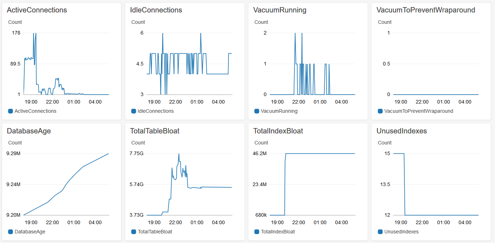

# Amazon Aurora Postgres Advanced Monitoring

## Overview

Amazon Aurora is a MySQL and PostgreSQL-compatible relational database built for the cloud, that combines the performance and availability of traditional enterprise databases with the simplicity and cost-effectiveness of open source databases. This GitHub project provides an advanced monitoring system for Amazon Aurora Postgres that is completely serverless, based on AWS Lambda and Amazon CloudWatch. A serverless Lambda function runs on a schedule, connects to the configured Aurora Postgres cluster, and generates CloudWatch custom metrics that are visualized on a custom dashboard. You can create alarms based on these metrics to gain additional visibility and improve incident response capabilities for your database. 

A [list of metrics](#MetricDefinitions) emitted by this solution is provided below, along with a description of what to watch for in relation to each metric.

This project is a fork of the [amazon-redshift-monitoring](https://github.com/awslabs/amazon-redshift-monitoring) solution. Many thanks to the developers of the original project for providing a solid, extensible foundation on which to build.

## <a name="PreReqs"></a>Pre-Requisites

Follow the steps below to prepare your environment to run the Aurora Postgres Enhanced Monitoring solution:

1. Create a user in Aurora Postgres that will be used by the Lambda function to connect to the database and run the monitoring queries. This user should have access to the tables in the "pg_catalog" schema. For example: 

    ```sql 
    GRANT SELECT ON ALL TABLES IN SCHEMA pg_catalog TO tamreporting
    ```
1. Create a KMS key in the same region as the Aurora Postgres Cluster. Take note of the key ARN. ([Documentation](http://docs.aws.amazon.com/kms/latest/developerguide/create-keys.html))
1. Encrypt the password of the user with the KMS key and take note of the Base64-encoded result. An example of encrypting a plaintext value with a customer-managed KMS key using the awscli is shown below.

    ```bash
    aws kms encrypt \
        --key-id kd83nf8w-ls84-8fm2-90df-ks975nvls01a \
        --plaintext MyPassword \
        --output text 
    ```
1. If your Aurora Postgres instance is not publicly accessible, you will need to use the VPC template below, and the additional requirements below will apply:
    * You will need at least two private subnets (You cannot use public subnets)
    * Security Group rules must allow access to the Aurora Postgres cluster 
    * Network access must be allowed from the Lambda function to the KMS and CloudWatch services
        * Option 1: Setup VPC endpoints for the KMS and CloudWatch services ([Documentation](https://docs.aws.amazon.com/vpc/latest/userguide/vpc-endpoints.html))
        * Option 2: Setup a NAT Gateway for the private subnets to give the Lambda function access to the public service endpoints. Ensure routes are created to properly route traffic through the NAT Gateway ([AWS blog](https://aws.amazon.com/blogs/aws/new-access-resources-in-a-vpc-from-your-lambda-functions/))

## Installation

This solution can be automatically deployed using a Serverless Application Model (SAM) in CloudFormation. 

The SAM stack will create:
* An IAM Role called LambdaAuroraPostgresMonitoringRole
* A single IAM Policy called LambdaAuroraPostgresMonitoringPolicy that is linked to the IAM Role and can:
  *  Decrypt the KMS Key used to encrypt the cluster password (kms::Decrypt)
  *  Emit CloudWatch metrics (cloudwatch::PutMetricData)
* A dashboard to display the custom metrics

Use the links below to walk through the CloudFormation deployment model.

|Region | VPC Template | Non-VPC Template |
|---- |---- | ----|
|ap-northeast-1| [](https://console.aws.amazon.com/cloudformation/home?region=ap-northeast-1#/stacks/new?stackName=AuroraPostgresAdvancedMonitoring&templateURL=https://paramsey-cfn-ap-northeast-1.s3.amazonaws.com/AuroraPostgresAdvancedMonitoring/deploy-vpc.yaml) | [](https://console.aws.amazon.com/cloudformation/home?region=ap-northeast-1#/stacks/new?stackName=AuroraPostgresAdvancedMonitoring&templateURL=https://paramsey-cfn-ap-northeast-1.s3.amazonaws.com/AuroraPostgresAdvancedMonitoring/deploy-non-vpc.yaml) |
|ap-northeast-2| [](https://console.aws.amazon.com/cloudformation/home?region=ap-northeast-2#/stacks/new?stackName=AuroraPostgresAdvancedMonitoring&templateURL=https://paramsey-cfn-ap-northeast-2.s3.amazonaws.com/AuroraPostgresAdvancedMonitoring/deploy-vpc.yaml) | [](https://console.aws.amazon.com/cloudformation/home?region=ap-northeast-2#/stacks/new?stackName=AuroraPostgresAdvancedMonitoring&templateURL=https://paramsey-cfn-ap-northeast-2.s3.amazonaws.com/AuroraPostgresAdvancedMonitoring/deploy-non-vpc.yaml) |
|ap-northeast-3| [](https://console.aws.amazon.com/cloudformation/home?region=ap-northeast-3#/stacks/new?stackName=AuroraPostgresAdvancedMonitoring&templateURL=https://paramsey-cfn-ap-northeast-3.s3.amazonaws.com/AuroraPostgresAdvancedMonitoring/deploy-vpc.yaml) | [](https://console.aws.amazon.com/cloudformation/home?region=ap-northeast-3#/stacks/new?stackName=AuroraPostgresAdvancedMonitoring&templateURL=https://paramsey-cfn-ap-northeast-3.s3.amazonaws.com/AuroraPostgresAdvancedMonitoring/deploy-non-vpc.yaml) |
|ap-south-1| [](https://console.aws.amazon.com/cloudformation/home?region=ap-south-1#/stacks/new?stackName=AuroraPostgresAdvancedMonitoring&templateURL=https://paramsey-cfn-ap-south-1.s3.amazonaws.com/AuroraPostgresAdvancedMonitoring/deploy-vpc.yaml) | [](https://console.aws.amazon.com/cloudformation/home?region=ap-south-1#/stacks/new?stackName=AuroraPostgresAdvancedMonitoring&templateURL=https://paramsey-cfn-ap-south-1.s3.amazonaws.com/AuroraPostgresAdvancedMonitoring/deploy-non-vpc.yaml) |
|ap-southeast-1| [](https://console.aws.amazon.com/cloudformation/home?region=ap-southeast-1#/stacks/new?stackName=AuroraPostgresAdvancedMonitoring&templateURL=https://paramsey-cfn-ap-southeast-1.s3.amazonaws.com/AuroraPostgresAdvancedMonitoring/deploy-vpc.yaml) | [](https://console.aws.amazon.com/cloudformation/home?region=ap-southeast-1#/stacks/new?stackName=AuroraPostgresAdvancedMonitoring&templateURL=https://paramsey-cfn-ap-southeast-1.s3.amazonaws.com/AuroraPostgresAdvancedMonitoring/deploy-non-vpc.yaml) |
|ap-southeast-2| [](https://console.aws.amazon.com/cloudformation/home?region=ap-southeast-2#/stacks/new?stackName=AuroraPostgresAdvancedMonitoring&templateURL=https://paramsey-cfn-ap-southeast-2.s3.amazonaws.com/AuroraPostgresAdvancedMonitoring/deploy-vpc.yaml) | [](https://console.aws.amazon.com/cloudformation/home?region=ap-southeast-2#/stacks/new?stackName=AuroraPostgresAdvancedMonitoring&templateURL=https://paramsey-cfn-ap-southeast-2.s3.amazonaws.com/AuroraPostgresAdvancedMonitoring/deploy-non-vpc.yaml) |
|ca-central-1| [](https://console.aws.amazon.com/cloudformation/home?region=ca-central-1#/stacks/new?stackName=AuroraPostgresAdvancedMonitoring&templateURL=https://paramsey-cfn-ca-central-1.s3.amazonaws.com/AuroraPostgresAdvancedMonitoring/deploy-vpc.yaml) | [](https://console.aws.amazon.com/cloudformation/home?region=ca-central-1#/stacks/new?stackName=AuroraPostgresAdvancedMonitoring&templateURL=https://paramsey-cfn-ca-central-1.s3.amazonaws.com/AuroraPostgresAdvancedMonitoring/deploy-non-vpc.yaml) |
|eu-central-1| [](https://console.aws.amazon.com/cloudformation/home?region=eu-central-1#/stacks/new?stackName=AuroraPostgresAdvancedMonitoring&templateURL=https://paramsey-cfn-eu-central-1.s3.amazonaws.com/AuroraPostgresAdvancedMonitoring/deploy-vpc.yaml) | [](https://console.aws.amazon.com/cloudformation/home?region=eu-central-1#/stacks/new?stackName=AuroraPostgresAdvancedMonitoring&templateURL=https://paramsey-cfn-eu-central-1.s3.amazonaws.com/AuroraPostgresAdvancedMonitoring/deploy-non-vpc.yaml) |
|eu-north-1| [](https://console.aws.amazon.com/cloudformation/home?region=eu-north-1#/stacks/new?stackName=AuroraPostgresAdvancedMonitoring&templateURL=https://paramsey-cfn-eu-north-1.s3.amazonaws.com/AuroraPostgresAdvancedMonitoring/deploy-vpc.yaml) | [](https://console.aws.amazon.com/cloudformation/home?region=eu-north-1#/stacks/new?stackName=AuroraPostgresAdvancedMonitoring&templateURL=https://paramsey-cfn-eu-north-1.s3.amazonaws.com/AuroraPostgresAdvancedMonitoring/deploy-non-vpc.yaml) |
|eu-west-1| [](https://console.aws.amazon.com/cloudformation/home?region=eu-west-1#/stacks/new?stackName=AuroraPostgresAdvancedMonitoring&templateURL=https://paramsey-cfn-eu-west-1.s3.amazonaws.com/AuroraPostgresAdvancedMonitoring/deploy-vpc.yaml) | [](https://console.aws.amazon.com/cloudformation/home?region=eu-west-1#/stacks/new?stackName=AuroraPostgresAdvancedMonitoring&templateURL=https://paramsey-cfn-eu-west-1.s3.amazonaws.com/AuroraPostgresAdvancedMonitoring/deploy-non-vpc.yaml) |
|eu-west-2| [](https://console.aws.amazon.com/cloudformation/home?region=eu-west-2#/stacks/new?stackName=AuroraPostgresAdvancedMonitoring&templateURL=https://paramsey-cfn-eu-west-2.s3.amazonaws.com/AuroraPostgresAdvancedMonitoring/deploy-vpc.yaml) | [](https://console.aws.amazon.com/cloudformation/home?region=eu-west-2#/stacks/new?stackName=AuroraPostgresAdvancedMonitoring&templateURL=https://paramsey-cfn-eu-west-2.s3.amazonaws.com/AuroraPostgresAdvancedMonitoring/deploy-non-vpc.yaml) |
|eu-west-3| [](https://console.aws.amazon.com/cloudformation/home?region=eu-west-3#/stacks/new?stackName=AuroraPostgresAdvancedMonitoring&templateURL=https://paramsey-cfn-eu-west-3.s3.amazonaws.com/AuroraPostgresAdvancedMonitoring/deploy-vpc.yaml) | [](https://console.aws.amazon.com/cloudformation/home?region=eu-west-3#/stacks/new?stackName=AuroraPostgresAdvancedMonitoring&templateURL=https://paramsey-cfn-eu-west-3.s3.amazonaws.com/AuroraPostgresAdvancedMonitoring/deploy-non-vpc.yaml) |
|sa-east-1| [](https://console.aws.amazon.com/cloudformation/home?region=sa-east-1#/stacks/new?stackName=AuroraPostgresAdvancedMonitoring&templateURL=https://paramsey-cfn-sa-east-1.s3.amazonaws.com/AuroraPostgresAdvancedMonitoring/deploy-vpc.yaml) | [](https://console.aws.amazon.com/cloudformation/home?region=sa-east-1#/stacks/new?stackName=AuroraPostgresAdvancedMonitoring&templateURL=https://paramsey-cfn-sa-east-1.s3.amazonaws.com/AuroraPostgresAdvancedMonitoring/deploy-non-vpc.yaml) |
|us-east-1| [](https://console.aws.amazon.com/cloudformation/home?region=us-east-1#/stacks/new?stackName=AuroraPostgresAdvancedMonitoring&templateURL=https://paramsey-cfn-us-east-1.s3.amazonaws.com/AuroraPostgresAdvancedMonitoring/deploy-vpc.yaml) | [](https://console.aws.amazon.com/cloudformation/home?region=us-east-1#/stacks/new?stackName=AuroraPostgresAdvancedMonitoring&templateURL=https://paramsey-cfn-us-east-1.s3.amazonaws.com/AuroraPostgresAdvancedMonitoring/deploy-non-vpc.yaml) |
|us-east-2| [](https://console.aws.amazon.com/cloudformation/home?region=us-east-2#/stacks/new?stackName=AuroraPostgresAdvancedMonitoring&templateURL=https://paramsey-cfn-us-east-2.s3.amazonaws.com/AuroraPostgresAdvancedMonitoring/deploy-vpc.yaml) | [](https://console.aws.amazon.com/cloudformation/home?region=us-east-2#/stacks/new?stackName=AuroraPostgresAdvancedMonitoring&templateURL=https://paramsey-cfn-us-east-2.s3.amazonaws.com/AuroraPostgresAdvancedMonitoring/deploy-non-vpc.yaml) |
|us-west-1| [](https://console.aws.amazon.com/cloudformation/home?region=us-west-1#/stacks/new?stackName=AuroraPostgresAdvancedMonitoring&templateURL=https://paramsey-cfn-us-west-1.s3.amazonaws.com/AuroraPostgresAdvancedMonitoring/deploy-vpc.yaml) | [](https://console.aws.amazon.com/cloudformation/home?region=us-west-1#/stacks/new?stackName=AuroraPostgresAdvancedMonitoring&templateURL=https://paramsey-cfn-us-west-1.s3.amazonaws.com/AuroraPostgresAdvancedMonitoring/deploy-non-vpc.yaml) |
|us-west-2| [](https://console.aws.amazon.com/cloudformation/home?region=us-west-2#/stacks/new?stackName=AuroraPostgresAdvancedMonitoring&templateURL=https://paramsey-cfn-us-west-2.s3.amazonaws.com/AuroraPostgresAdvancedMonitoring/deploy-vpc.yaml) | [](https://console.aws.amazon.com/cloudformation/home?region=us-west-2#/stacks/new?stackName=AuroraPostgresAdvancedMonitoring&templateURL=https://paramsey-cfn-us-west-2.s3.amazonaws.com/AuroraPostgresAdvancedMonitoring/deploy-non-vpc.yaml) |

You must supply the following parameters for the template:
* ClusterEndpoint - Primary endpoint address of your Aurora Postgres cluster
* ClusterName - Name of your cluster (This is used as a dimension on the CloudWatch metrics)
* ClusterPort - Port of the primary cluster endpoint
* DatabaseName - Name of the database to connect to
* DatabaseUser - Name of the database user that has permission to run the necessary monitoring queries
* EncryptedPassword - Base64 encoded encrypted password
    >The password for the Aurora Postgres user *must* be encrypted with a customer-managed KMS key, and plaintext passwords are NOT supported. Furthermore, Lambda Environment Variables can also be [encrypted within the Lambda service using KMS](http://docs.aws.amazon.com/lambda/latest/dg/env_variables.html#env_encrypt). 
* KmsKeyARN - KMS key ARN used to decrypt the password
* ScheduleFrequency - Frequency with which to run your lambda function

For the VPC Template, you must also supply the following parameters:
* SecurityGroups - CSV list of Security Group IDs to use for the deployed function
* SubnetIds - CSV list of private subnet IDs in the VPC in which the function will egress network connections

If you wish to deploy manually, you can use the prebuilt zip in the [dist](dist) folder, or you can build it yourself. We've included a [build script](build.sh) for bash shell that will create a zip file which you can upload into AWS Lambda.

## Configuration 

There are two options for passing configuration parameters to the function.

### <a name="EventJson"></a>Option 1: Using Event Parameters (Preferred)

This option allows you to send the configuration as part of the Scheduled Event, which means you can support multiple clusters from a single Lambda function. This option will override any Environment variables that you've configured. An example event looks like:

```json
{
    "DatabaseUser": "postgres",
    "EncryptedPassword": "AQICAHjCCIl/+A5oJxOzGSOe2e3e5QoGkTztWuyBXcpjvd6n7gHzY5qHG601eFMvAptttlNJAAAAcTBvBgkqhkiG9w0BBwagYjBgAgEAMFsGCSqGSIb3DQEHATAeBglghkgBZQMEAS4wEQQMSOzWxmUpBW8lgEwnAgEQgC7srWfyJD/btzn46ru8E3/Z+f4cHqT/3pcoVkkYNi9wGQuE8GcS/5fB94lRLlmW",
    "ClusterName": "database-1",
    "ClusterEndpoint": "database-1.cluster-dghfvwtswhfx.us-east-1.rds.amazonaws.com",
    "ClusterPort": "5432",
    "DatabaseName": "mydatabase",
    "ScheduleFrequency": "5 minutes",
    "Debug": "True"
}
```

### Option 2: Using Environment Variables

You can also use [Lambda Environment Variables](http://docs.aws.amazon.com/lambda/latest/dg/env_variables.html) for configuration, including:

```json
"Environment": {
        "Variables": {
            "DatabaseUser": "database user name",
            "EncryptedPassword": "KMS encrypted password",
            "ClusterName": "display name for cloudwatch metrics",
            "ClusterEndpoint": "the writer endpoint of the cluster",
            "ClusterPort": "database part number",
            "DatabaseName": "database name",
            "ScheduleFrequency": "5 minutes",
            "Debug": "True"
        }
    }
```

## Manual Deployment Instructions

If you are rebuilding the function or deploying it manually instead of using the provided CloudFormation templates, perform the following steps:

1. Create a Role for the Lambda function. At a minimum, this role should have the policy `AWSLambdaVPCAccessExecutionRole` to be able to run in a VPC, and the custom policy below to access the KMS key:

    ```json
    {
        "Version": "2012-10-17",
        "Statement": [
            {
                "Sid": "Stmt1458213823000",
                "Effect": "Allow",
                "Action": [
                    "kms:Decrypt"
                ],
                "Resource": [
                    "<kms key arn>"
                ]
            },
            {
                "Sid": "Stmt1458218675000",
                "Effect": "Allow",
                "Action": [
                    "cloudwatch:PutMetricData"
                ],
                "Resource": [
                    "*"
                ]
            }
        ]
    }
    ```
1. Download and install dependencies
   ```bash
   pip install -r requirements.txt -t .
   ```

1. Assemble and compress the Lambda function package:
    
    Option 1: Standard build
    ```bash
    ./build.sh
    ```

    Option 2: Build with user query extensions
    ```bash
    ./build.sh --include-user-queries
    ```
    >Please note the labelled version in Github does not include any user queries.
1. Create a Lambda function, and upload the zip file generated by the build script. some of the parameters of the function are:
    * Runtime: Python 3.6
    * Handler: `lambda_function.lambda_handler`
    * Role: Use the role created above
    * Memory: 256MB
    * Timeout: 5 minutes
    * VPC: Use the same VPC as the Aurora Postgres cluster. 

1.  Add an Event Source to the Lambda function with a Scheduled Event, running with the same frequency you configured in the Lambda function.

## Confirming Successful Execution

After a period of time, you can check your CloudWatch metrics and create alarms. You can also view the AuroraPostgresAdvancedMonitoringDashboard that was created as part of the CloudFormation script to visualize the custom metrics.




If the metrics are not being emitted properly after deploying the solution, send a test event to the Lambda function with a JSON payload similar to [the one shown above](#EventJson) where Debug is set to True (update parameters to match your environment). This will log additional details to help you uncover the cause of the failure. The most common issues are 1) Lack of network connectivity between the Lambda function amd the KMS and Cloudwatch APIs, and 2) Insufficient permissions on the database. [Review the Pre-Requisites](#PreReqs) for solutions to these issues.

## <a name="MetricDefinitions"></a>Metric Definitions

This solution emits the following custom metrics for the connected Aurora Postgres instance.

* **IdleConnections** - This metric measures the connections opened to the database but are not in use. If you see a high count of idle connections, it’s worth investing in setting up a connection pooler such as PgBouncer. 
* **ActiveConnections** - This metric measures the connections opened to the database and are actively in use. If you see a high count of active connections, it’s worth investigating the root cause by querying pg_stat_activity e.g. `SELECT client_addr, application_name,COUNT(*) from pg_stat_activity GROUP BY 1,2;` . Make sure this count doesn't reach max_connections.
* **VacuumRunning** - This metric measures the total number of autovacuum jobs running. If this value is equal to autovacuum_max_workers for a long time, consider increasing autovacuum_max_workers parameter value.
* **VacuumToPreventWraparound** - This metric measures the total number of autovacuum jobs running to prevent wraparound issue. This is an IO intensive job. To avoid this, either modify autovacuum_freeze_max_age parameter or run manual VACUUM FREEZE during a maintenance window, e.g. `vacuumdb --all --freeze --jobs=2 --echo --analyze`. 
* **DatabaseAge** - This metric measures the number of unvacuumed transactions. This should not reach 2.1 billion. An alarm should be set up when this metric reaches a value of 1 billion or a low severity warning at 500 million. 
* **TotalTableBloat** - This metric measures the total space occupied by dead tuples in all tables of the database. When this metric reaches a high value, maintenance_work_mem should be increased, autovacuum parameters should be tuned, manual vacuum should be performed, or pg_repack utility should be used to shrink tables.
* **TotalIndexBloat** - This metric measures the total space occupied by bloated indexes in database. When this metric reaches a high value, maintenance_work_mem should be increased, autovacuum parameters should be tuned, REINDEX should be performed, or pg_repack utility should be used to shrink indexes.
* **IndexHitRatio** - This metric measures the percentage of requests that are served by the indexes in shared_buffer. The value should be about 99%. If it is not, you might need to find the root cause and/or increase the buffer size. 
* **UnusedIndexes** - This metric measures the unused indexes since last stats reset. These indexes should be investigated and deleted if they are no longer needed. 
* **DBSize** - This metric measures the size of all databases in PostgreSQL cluster.
* **TotalInsert** - This metric measures the total number of Inserts since the last statistics reset.
* **TotalUpdate** - This metric measures the total number of Updates since the last statistics reset.
* **TotalDelete** - This metric measures the total number of Deletes since the last statistics reset.
* **TotalHotUpdate** - This metric measures the total number of Hot Updates since the last statistics reset.
* **BlockedQueries** - This metric measures the total number of blocked queries at a given time. Most of the times this situation occurs due to deadlocks. Deadlocks should be investigated and resolved. 
* **TableHitRatio** - This metric measures the percentage of requests that are served by the tables in shared_buffer. It should be about 99%. If it is not, you might need to find the root cause and increase buffer size.


## Extensions

The published CloudWatch metrics are all configured in a JSON file called `monitoring-queries.json`. These are queries that have been built by Amazon Aurora Postgres subject matter experts, and they provide detailed metrics about the operation of your cluster.

If you would like to create your own queries to be instrumented via Amazon CloudWatch, these can be added into the [user-queries.json](user-queries.json) file. The file is a JSON array, with each query having the following structure:

```
{
	"query": "my select query that returns a numeric value",
	"name":"MyQuery",
	"unit":"Count | Seconds | Milliseconds | Whatever",
	"type":"value"
}
```

----

Copyright 2020-2020 Amazon.com, Inc. or its affiliates. All Rights Reserved.

Licensed under the Apache License, Version 2.0 (the "License");
you may not use this file except in compliance with the License.
You may obtain a copy of the License at

    http://www.apache.org/licenses/LICENSE-2.0

Unless required by applicable law or agreed to in writing, software
distributed under the License is distributed on an "AS IS" BASIS,
WITHOUT WARRANTIES OR CONDITIONS OF ANY KIND, either express or implied.
See the License for the specific language governing permissions and
limitations under the License.